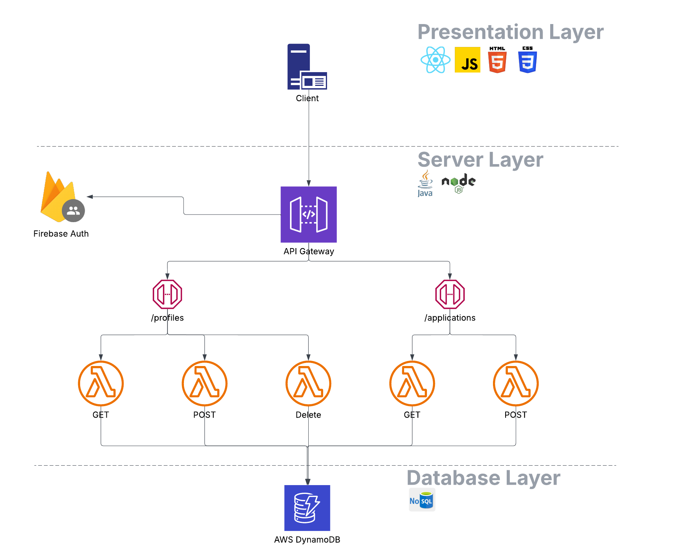

<div align="center">

  
  
  
  
  
  

</div>

<br />
<br />

<br />
<div align="center">
  <a href="https://github.com/i">
    
  </a>

<h3 align="center">Trackit<br>Application Tracker</h3>

  <p align="center">
    Trackit is an application tracking system which allows users to better manage their job hunting process, gain insights into their progress, and stay on top of opportunities.
    <br />
    <a href="https://trackit-1-ha2j.onrender.com"><strong>Visit Site»</strong></a>
    &middot;
    <a href="https://github.com/Iliyabel/Trackit"><strong>Explore the docs »</strong></a>
    <br />
    <br />
  </p>
</div>

<!-- TABLE OF CONTENTS -->
<details>
  <summary>Table of Contents</summary>
  <ol>
    <li>
      <a href="#ℹ️-about-the-project">ℹ️ About The Project</a>
    <li><a href="#📌-getting-started">📌 Getting Started</a></li>
            <ul>
    <li><a href="#prerequisites">Prerequisites</a></li>
    <li><a href="#installation">Installation</a></li>
    <li><a href="#usage">Usage</a></li>
      </ul>
    </li>
    <li>
      <a href="🛠️-built-with">🛠️ Built with</a>
    </li>
    <li><a href="🛣️-roadmap">🛣️ Roadmap</a></li>
    <li><a href="#👥-contributors">👥 Contributors</a></li>
  </ol>
</details>


<!-- ABOUT THE PROJECT -->
## ℹ️ About The Project


Trackit allows users to login then add, edit and delete job applications. It gives an easy-to-use UI, delivering key insights on your job hunt and full control on sortting, filter and querying for job applications. 

<p align="right">(<a href="#readme-top">back to top</a>)</p>

<!-- HOW TO USE -->
## 📌 Getting Started

You can visit our deployed site <a href="https://trackit-1-ha2j.onrender.com">here</a>. See below on deploying the code locally.  

### Prerequisites

* AWS API gateway URL
  ```
  VITE_DB_API_URL=https://exampleARN.execute-api.us-west-2.amazonaws.com/stage
  ```

* npm
  ```sh
  npm install npm@latest -g
  ```

### Installation
1. Clone the repo
   ```sh
   git clone https://github.com/Iliyabel/Trackit.git
   ```
2. Navigate to the client folder and install front-end dependencies. The backend is hosted by AWS and auth by Firebase.
   ```sh
   cd Trackit
   cd client
   npm install
   ```
3. Set your environment variables in `.env` file. See `.env.template` for variables.
   ```
   VITE_DB_API_URL=[API URL]
   ```

### Usage
Run the front end using Vite.
```
npm run dev
```

❗ NOTE: You can either create a new account or use our preconfigured example account. 

Example account login:
* Email: 
`ethan@example.com`
* Password: `Password!`

<p align="right">(<a href="#readme-top">back to top</a>)</p>


<!-- BUILT WITH -->
## 🛠️ Built With

### 💻 Frontend:<br>


### 🗄️Backend: <br>


### Architecture


Our projects backend uses serverless functions (Lambda) and AWS's API Gateway as a reverse proxy. The serverless functions are written in Java with the exception of the authorization Lambda which is written in javascript (to utilize the Firebase SDK). Authentication is done by Firebase Auth and public endpoints are protected by requiring an Authorizatino token from Firebase. The database is a NoSql AWS DynamoDB database. 

### React Dependencies


Our front end is rendered using React. We use the react router for navigation. Our website is composed of primarily 4 pages, and it uses a set of smaller components and utility classes. 

<p align="right">(<a href="#readme-top">back to top</a>)</p>

<!-- RoadMap -->
## 🛣️ Road Map
From our original proposal:

### P1 - Top Priority
- [x] Setup secure authentication system
- [x] Setup ~~SQL~~ NoSQL database and Rest API for CRUD commands
- [x] Create a front end that allows users to create and interact with job applications
  - [x] Add dynamic filter
  - [x] Ensure responsive UI (excluding mobile)
- [x] Deploy application using a cloud service
  - [x] Deploy front end using a CDN
  - [x] Deploy back end using serverless cloud functions

### P2 - Secondary
- [ ] Implement reminder feature allowing user to add To-dos
- [ ] Create an API to automatically parse a job posting and retrieve the application data

<!-- Contributions -->
## 👥 Contributors
<table>
  <tr>
    <td align="center">
      <a href="https://github.com/JLavigueure">
        <br />
        <sub><b>JLavigueure</b></sub>
      </a>
    </td>
    <td align="center">
      <a href="https://github.com/Iliyabel">
        <br />
        <sub><b>Iliyabel</b></sub>
      </a>
    </td>
    <td align="center">
      <a href="https://github.com/acheema5">
        <br />
        <sub><b>acheema5</b></sub>
      </a>
    </td>
    <td align="center">
      <a href="https://github.com/srames50">
        <br />
        <sub><b>srames50</b></sub>
      </a>
    </td>
  </tr>
</table>
